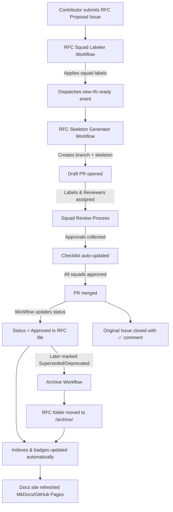

# 📜 RFC Process Guide

This document explains the **lifecycle of an RFC** (Request for Comments) in this repository.
All steps are automated with GitHub Actions — authors focus on **content**, automation handles **workflow**.

---

## 🔄 Lifecycle Overview

1. **Proposal** → Author submits a new RFC idea.
2. **Draft PR** → Automation creates a branch + RFC skeleton folder.
3. **In Review** → RFC PR enters review with assigned squads.
4. **Approval** → All required squads approve → PR merged → Status = Approved.
5. **Implementation** → Changes delivered in product code, status can be updated to Implemented.
6. **Archive** → RFC marked Superseded/Deprecated → automation moves it to `/archive/`.

---



---

## 📝 Step 1 — Proposing a New RFC

* Open a new issue using the **[RFC Proposal form](../../issues/new?template=rfc-proposal.yml)**.
* Provide:

  * Title
  * Summary / Motivation
  * Author(s)
  * Impacted squads (Foundry, SDK, Iris, Flare)
* Submit the issue.

👉 Automation will:

* Create a new branch: `rfc/RFC-XYZ-title`
* Generate a full boilerplate skeleton under `rfcs/RFC-XYZ-title/`
* Pre-fill metadata (ID, Title, Author, Date, Status = Draft)
* Open a **draft PR** and auto-assign squad reviewers

---

## 🛠️ Step 2 — Working on the RFC

Inside the PR, the RFC folder looks like:

```
rfcs/
└── RFC-XYZ-title/
    ├── RFC-XYZ-title.md     # Main spec
    ├── design/
    │   ├── HLD.md
    │   ├── LLD.md
    │   └── Deployment.md
    ├── diagrams/
    │   └── README.md
    ├── notes/
    │   ├── meeting-notes.md
    │   └── decisions-log.md
    └── README.md
```

* Fill in **RFC-XYZ-title.md** using the provided structure.
* Add diagrams under `/diagrams/`.
* Add detailed design docs under `/design/`.
* Capture discussion points in `/notes/`.

---

## 👥 Step 3 — Review Process

* The PR automatically sets RFC **Status = In Review**.
* Required squads are auto-labeled (e.g., `squad/sdk`, `squad/foundry`).
* At least **one reviewer per squad** must approve.
* If any squad is missing, the check will fail and the PR cannot merge.

👉 The PR timeline will show comments like:

```
🔄 RFC status updated: In Review
✅ All required squads approved!
```

---

## ✅ Step 4 — Approval & Merge

* Once all squads approve → PR can merge.
* Automation updates the RFC **Status = Approved**.
* The RFC appears in the **Active RFC Index**.
* Badges in `README.md` update automatically.

---

## 🚀 Step 5 — Implementation

* After the design is implemented in product code, the RFC author (or maintainer) may update status to **Implemented** via a follow-up PR.
* Implementation details (links to code, commits, rollout notes) can be added to `Deployment.md` or RFC metadata.

---

## 📦 Step 6 — Archival

* If an RFC becomes obsolete:

  * Update its metadata `Status` to **Deprecated** or **Superseded**.
* Automation will:

  * Move the RFC folder into `/archive/`
  * Update the **Archived RFC Index**
  * Refresh badges and indexes automatically

---

## 📊 Indexes & Badges

Indexes are **auto-generated**:

* [`RFC_INDEX.md`](./RFC_INDEX.md) → Active RFCs
* [`IN_PROGRESS_INDEX.md`](./IN_PROGRESS_INDEX.md) → Drafts / In Review
* [`archive/RFC_ARCHIVE_INDEX.md`](./archive/RFC_ARCHIVE_INDEX.md) → Archived RFCs

Badges in `README.md` always reflect reality:

```
[](./RFC_INDEX.md)
[](./RFC_INDEX.md)
[](./IN_PROGRESS_INDEX.md)
[](./archive/RFC_ARCHIVE_INDEX.md)
```

---

## 📌 Status Legend

* **Draft** → Skeleton created, not yet in review
* **In Review** → PR open, reviewers assigned
* **Approved** → PR merged, RFC accepted
* **Implemented** → Delivered in product code
* **Superseded** → Replaced by a newer RFC
* **Deprecated** → Obsolete, no longer relevant

---

## 🤝 Responsibilities

* **Author** → Writes RFC, owns content, updates status if needed
* **Reviewers (per squad)** → Must review & approve before merge
* **Automation** →

  * Generates skeleton
  * Updates status
  * Enforces cross-squad approvals
  * Maintains indexes & badges
  * Moves archived RFCs

---

✅ With this process:

* **Authors focus on design**.
* **Squads ensure alignment**.
* **Automation enforces consistency**.